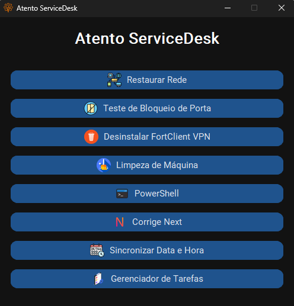

# Atento ServiceDesk


O **Atento ServiceDesk** é um launcher desenvolvido para agilizar o atendimento técnico dos analistas, automatizando scripts de manutenção, rede e VPN, otimizando o TMA e padronizando procedimentos.  

---

## 🎬 Demonstração da Interface



## Sumário
- [Objetivo do Projeto](#objetivo-do-projeto)
- [Escopo do Projeto](#escopo-do-projeto)
  - [Funcionalidades atuais](#funcionalidades-atuais)
  - [Requisitos não funcionais](#requisitos-não-funcionais)
- [Arquitetura Técnica](#arquitetura-técnica)
- [Aspectos Empresariais e Benefícios](#aspectos-empresariais-e-benefícios)
- [Processo de Implantação](#processo-de-implantação)
- [Código-Fonte e Estrutura](#código-fonte-e-estrutura)
  - [Funcionalidades Técnicas dos Botões do Atento ServiceDesk](#funcionalidades-técnicas-dos-botões-do-atento-servicedesk)
- [Inno Setup](#inno-setup)
- [Compilação](#compilação)
- [Considerações Finais](#considerações-finais)
- [Desenvolvimento e Colaborações](#desenvolvimento-e-colaborações)

---

## Objetivo do Projeto

A proposta central deste projeto é o desenvolvimento de uma nova interface denominada **Atento ServiceDesk**, uma launcher de uso exclusivo dos analistas. Essa ferramenta agiliza o atendimento de chamados por meio da execução automatizada de scripts específicos, otimizando o TMA.

---

## Escopo do Projeto

### Funcionalidades atuais
- **Restaurar Rede:** Libera e renova o IP, limpa cache DNS e reinicia adaptadores de rede ativos.
- **Configurar DNS automático:** Reseta configurações de DNS para obter via DHCP.
- **Desativar Teredo, IPv6 e Hyper-V:** Desativa componentes que podem causar conflitos de rede.
- **Importar arquivos `.reg`:** Executa importação silenciosa de registros do Windows para configuração TLS.
- **Desinstalar FortClient VPN:** Interface simples para remover o cliente VPN, com feedback ao usuário.
- **Limpeza de arquivos temporários:** Executa um script batch para limpeza de arquivos temporários e logs.
- **Abrir PowerShell:** Abre uma janela PowerShell para uso avançado pelo analista.
- **Sincronizar data e hora:** Sincroniza o relógio do sistema via comando de rede com servidor interno.
- **Teste de conexão em portas VPN:** Verifica se portas específicas estão abertas para acesso VPN.
- **Correção genérica do Vivo Next:** Apaga as pastas **Sun** e **JxBrowser**, responsáveis por impedir a abertura do sistema.

### Requisitos não funcionais
- Execução com privilégios administrativos (UAC elevado automático).
- Interface gráfica moderna e responsiva com tema escuro, usando CustomTkinter.
- Empacotamento para distribuição fácil via instalador (Inno Setup).
- Inclusão de ícones e recursos visuais para melhor UX.
- Estrutura modular para fácil manutenção e futuras atualizações.

---

## Arquitetura Técnica
- **Linguagem:** Python 3.x
- **Framework GUI:** CustomTkinter com suporte a temas e ícones via PIL.
- **Empacotamento:** PyInstaller para gerar executável único (`atentoservicedesk.exe`).
- **Instalador:** Inno Setup, configurado para instalação em `C:\AtentoBrasil` com criação de atalhos.
- **Scripts auxiliares:** Arquivos `.bat` para limpeza, arquivos `.reg` para configurações específicas.
- **Uso de PowerShell:** Para comandos de rede avançados e configurações do sistema.
- **Execução Elevada:** Uso de `ctypes.windll.shell32.IsUserAnAdmin()` para garantir execução com admin.

---

## Aspectos Empresariais e Benefícios
- **Redução do TMA:** Automatizando rotinas repetitivas, os analistas ganham tempo para casos mais complexos.
- **Padronização:** Uso de scripts oficiais reduz erros humanos e aumenta a confiabilidade do atendimento.
- **Facilidade de uso:** Interface única e intuitiva diminui a curva de aprendizado para novos analistas.
- **Segurança:** Execução controlada e com privilégios necessários evita falhas por permissões inadequadas.
- **Escalabilidade:** Estrutura preparada para inclusão contínua de novas ferramentas e integrações.
- **Controle:** Centralização da distribuição e atualização do launcher via instalador padronizado.

---

## Processo de Implantação
- **Desenvolvimento:** Programação e testes em ambiente controlado.
- **Empacotamento:** Criação do executável via PyInstaller com todos os recursos embutidos.
- **Distribuição:** Geração do instalador Inno Setup para facilitar deploy em estações de trabalho.
- **Treinamento:** Capacitação dos analistas para uso correto da ferramenta.
- **Suporte e evolução:** Coleta de feedback para aprimoramentos e adição de funcionalidades.

---

## Código-Fonte e Estrutura

(O código completo está anexado — desenvolvido em Python, estruturado em funções claras, com interface usando CustomTkinter e gerenciamento de recursos via `resource_path`.)

### Funcionalidades Técnicas dos Botões do Atento ServiceDesk

| Botão | Ação Executada | Lógica Técnica |
|-------|----------------|----------------|
| **Restaurar Rede** | Restaura rede, limpa DNS, força IP novo, desativa IPv6/Teredo/Hyper-V e importa `.reg` de configuração. | Executa `ipconfig /release`, `renew`, `flushdns`, usa PowerShell para desabilitar/reabilitar adaptadores de rede, aplica chaves `.reg` (TLS e configs de proxy). |
| **Teste de Bloqueio de Porta** | Verifica se as portas da VPN (Vivo e Mercado Livre) estão abertas. | Usa `socket.create_connection()` para testar conexão nas portas (20471 e 20445). Retorna status "Aberta" ou "Bloqueada". |
| **Desinstalar FortClient VPN** | Desinstala o FortClient VPN, se instalado. | Usa `wmic product where name="FortClient VPN" call uninstall`. Exibe mensagens conforme sucesso, falha ou inexistência do software. |
| **Limpeza de Máquina** | Executa script de limpeza de arquivos temporários. | Localiza e executa o `limpa_temporarios.bat` embutido no instalador. Retorna mensagens de sucesso ou erro. |
| **PowerShell** | Abre um terminal do PowerShell interativo. | Executa `start powershell.exe -NoExit` via `subprocess.Popen`. |
| **Corrige Next** | Remove caches e pastas corrompidas do **JX Browser** e **Sun Java**, corrigindo erros do sistema Next. | Remove diretórios no `%LOCALAPPDATA%`, `%APPDATA%` e `LocalLow` com comandos `rmdir`. |
| **Sincronizar Data e Hora** | Sincroniza o horário do computador com o servidor `CABRTSADC02`. | Executa `net time /set \\CABRTSADC02.clienteap.br /yes`. Se falhar, usa `w32tm /resync` como fallback. |
| **Gerenciador de Tarefas** | Abre diretamente o **Task Manager**. | Executa `taskmgr.exe` via `subprocess.Popen`. |

---

## Inno Setup

```ini
[Setup]
AppName=Atento ServiceDesk
AppVersion=1.0
DefaultDirName=C:\AtentoBrasil\Atento ServiceDesk
DefaultGroupName=Atento ServiceDesk
OutputDir=dist
OutputBaseFilename=AtentoServiceDeskSetup
SetupIconFile=dist\icone.ico
Compression=lzma
SolidCompression=yes
PrivilegesRequired=admin

[Files]
Source: "dist\atentoservicedesk.exe"; DestDir: "{app}"; Flags: ignoreversion
Source: "limpa_temporarios.bat"; DestDir: "{app}"; Flags: ignoreversion
Source: "regs\*"; DestDir: "{app}\regs"; Flags: recursesubdirs createallsubdirs
Source: "icones\*"; DestDir: "{app}\icones"; Flags: recursesubdirs createallsubdirs

[Icons]
Name: "{group}\Atento ServiceDesk"; Filename: "{app}\atentoservicedesk.exe"
Name: "{commondesktop}\Atento ServiceDesk"; Filename: "{app}\atentoservicedesk.exe"

[Run]
Filename: "{app}\atentoservicedesk.exe"; Description: "Abrir Atento ServiceDesk"; Flags: nowait postinstall skipifsilent unchecked
```

Compilação
pyinstaller --noconsole --onefile --icon=icone.ico \
--add-data "icone.ico;." \
--add-data "icones;icones" \
--add-data "regs;regs" \
--add-data "limpa_temporarios.bat;." \
atentoservicedesk.py

Considerações Finais

O Atento ServiceDesk se apresenta como solução estratégica para agilizar e padronizar o atendimento técnico na empresa, promovendo ganhos operacionais e qualidade no suporte. A manutenção contínua e o foco em novas demandas garantirão a longevidade e a eficácia da ferramenta.

Desenvolvimento e Colaborações

Desenvolvedor: Lucas Felipe Ciríaco

Colaboração: Rafael Paulino Ribas, Ruan Shizuo Miyagaki, Roger Paulino Ribas, Arthur Santana Pizolio e Henrique Santana Pardinho
